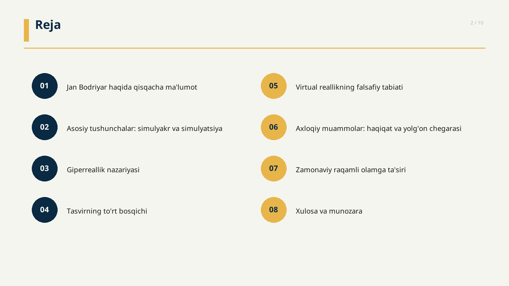
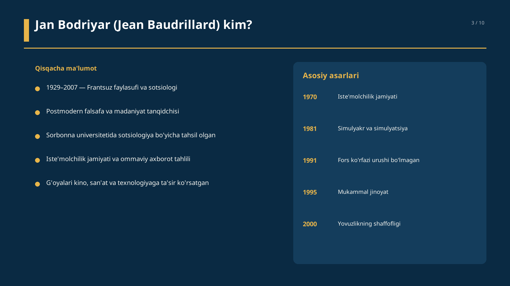
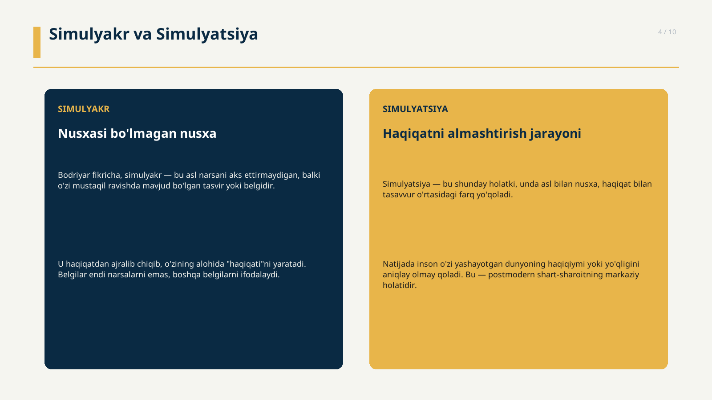
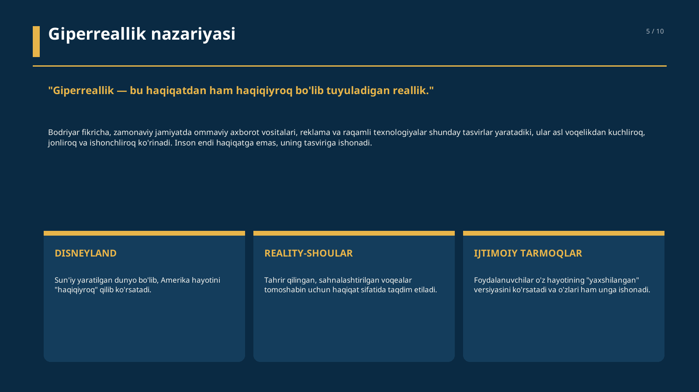
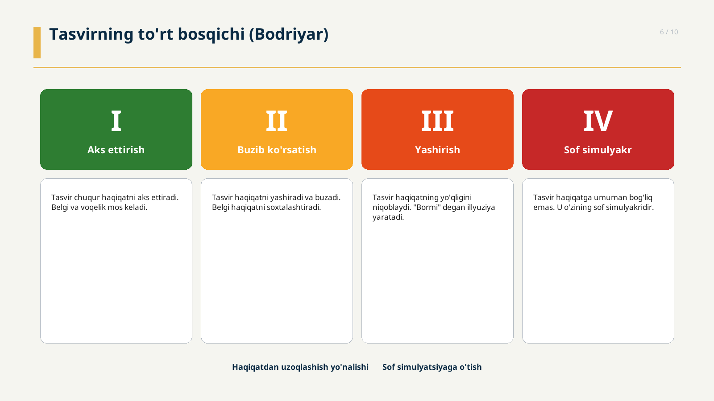
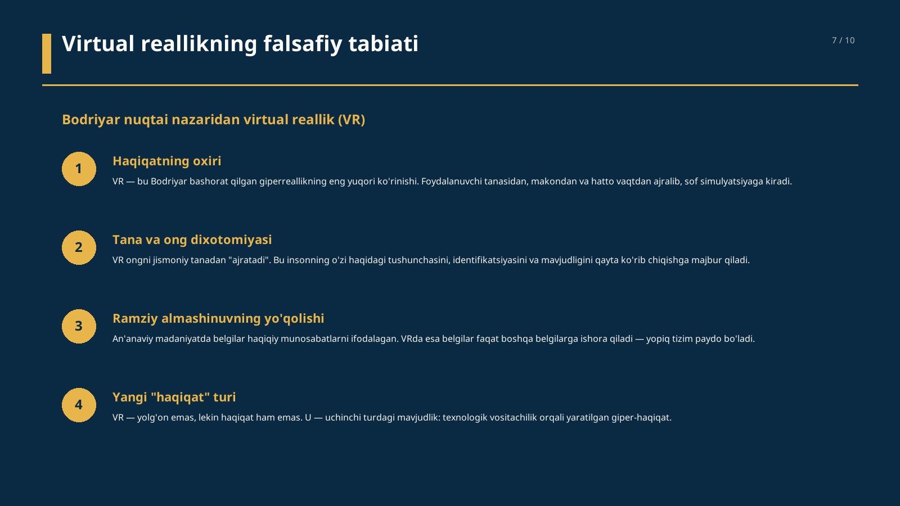
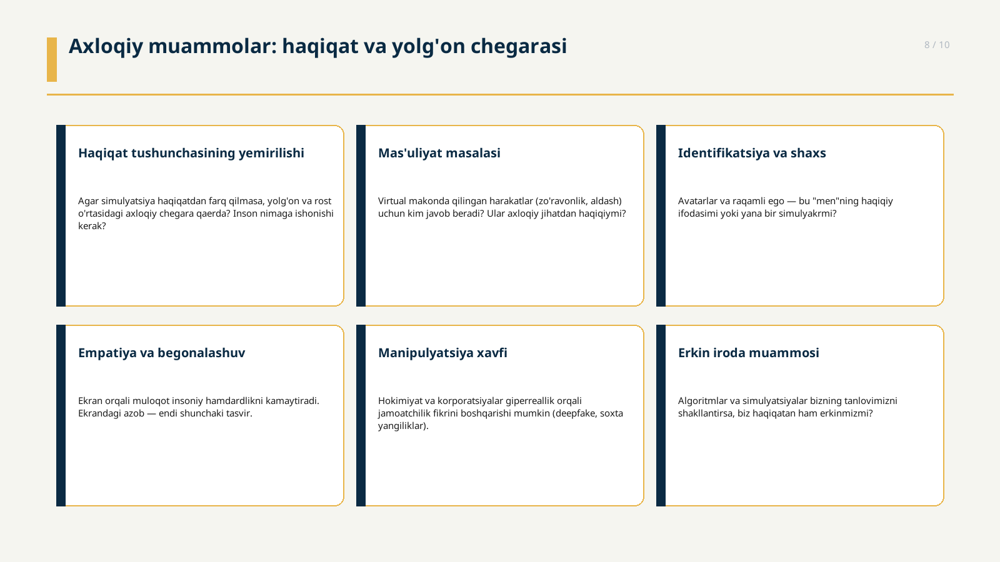
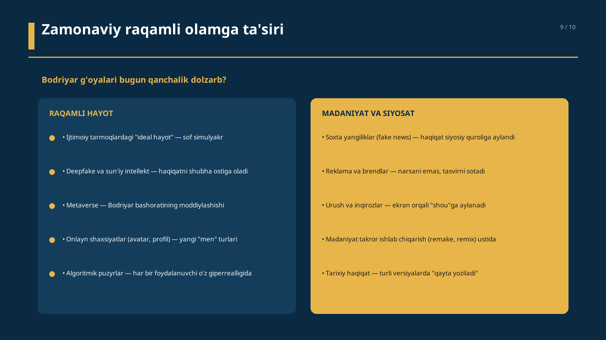

# Jan Bodriyar — Virtual Reallik va Axloqiy Muammolar

Jan Bodriyar (Jean Baudrillard) g'oyalari asosida virtual reallik va axloqiy muammolar tahlili.

## 📥 Yuklab olish

- **PowerPoint fayli (`.pptx`):** [Bodriyar_Virtual_Reallik.pptx](Bodriyar_Virtual_Reallik.pptx) — [raw yuklab olish](https://github.com/chinpolatovumidjon88-lab/BADIRYAR/raw/main/Bodriyar_Virtual_Reallik.pptx)
- **Barcha slaydlar PNG sifatida:** [`slides/`](slides/) papkasida

## 🖼️ Slaydlar

### Slayd 1 — Sarlavha


### Slayd 2 — Reja


### Slayd 3 — Jan Bodriyar haqida


### Slayd 4 — Simulyakr va Simulyatsiya


### Slayd 5 — Giperreallik nazariyasi


### Slayd 6 — Tasvirning to'rt bosqichi


### Slayd 7 — Virtual reallikning falsafiy tabiati


### Slayd 8 — Axloqiy muammolar


### Slayd 9 — Zamonaviy raqamli olamga ta'siri


### Slayd 10 — Xulosa


## 📂 Fayllar

| Fayl | Tavsif |
|------|--------|
| `Bodriyar_Virtual_Reallik.pptx` | PowerPoint prezentatsiyasi (10 slayd) |
| `create_presentation.py` | PPTX yaratuvchi Python skripti (`python-pptx`) |
| `render_slides.py` | Slaydlarni PNG sifatida render qiluvchi skript (`Pillow`) |
| `slides/` | Har bir slaydning PNG ko'rinishi |

## 🛠️ Qayta yaratish

```bash
pip install python-pptx Pillow
python3 create_presentation.py    # .pptx faylini yaratadi
python3 render_slides.py          # PNG slaydlarni yaratadi
```

## 📚 Asosiy manbalar

- Baudrillard, J. (1981). *Simulacres et Simulation*
- Baudrillard, J. (1970). *La Société de consommation*
- Baudrillard, J. (1991). *La Guerre du Golfe n'a pas eu lieu*
